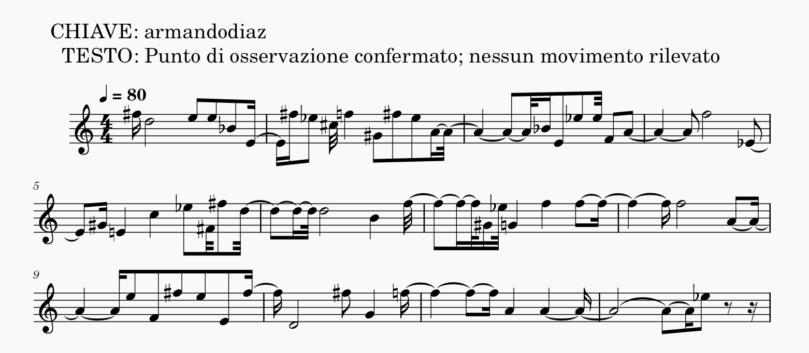
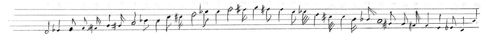
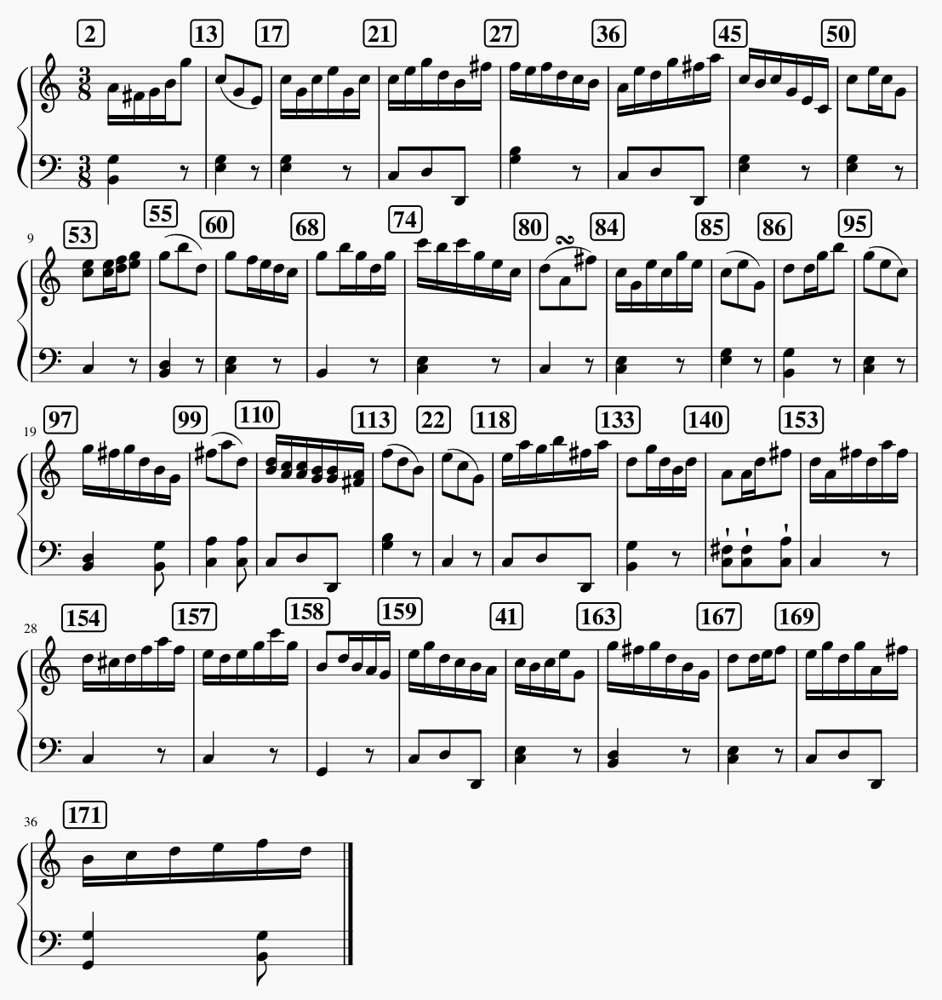
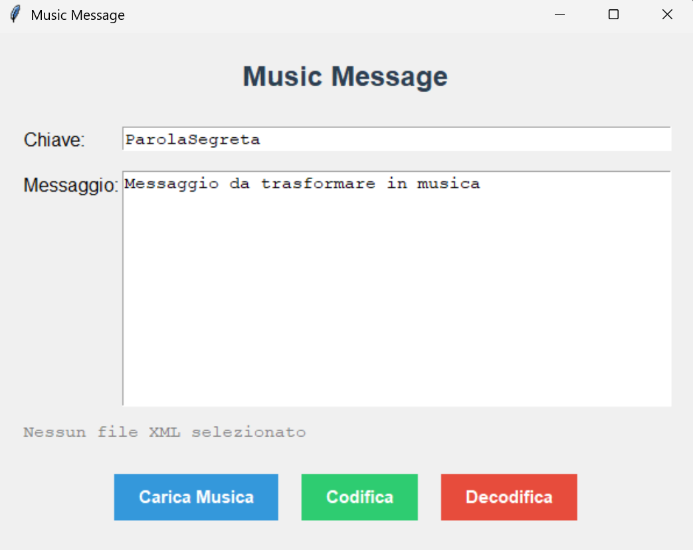

# 📃 Messaggi in Musica 🎼

Benvenuto in **Messaggi in Musica**, un innovativo progetto di cifratura che unisce l'informatica alla musica. Questo software consente di cifrare e decifrare messaggi testuali utilizzando un sistema polialfabetico ispirato al classico [Cifrario di Vigenère](https://it.wikipedia.org/wiki/Cifrario_di_Vigen%C3%A8re), traducendo le lettere non in semplici caratteri, ma in vere e proprie **note e strutture musicali**.

Mentre sul web esistono innumerevoli tool per la cifratura tradizionale, **Messaggi in Musica** colma un vuoto, offrendo un sistema per trasformare messaggi segreti in spartiti musicali digitali riproducibili.

---

## 💻 Le Due Versioni del Programma

Il progetto si compone di due varianti distinte, capaci di soddisfare sia l'approccio puramente matematico/sperimentale sia quello più melodico e tonale:

1. **🎶 Note Message (Approccio Meccanico)**
   * Impiega **singole note musicali** per la cifratura.
   * Produce sonorità particolari, dal tono similare a quello delle avanguardie e dello sperimentalismo musicale.
2. **🎼 Music Message (Approccio Tonale - Minuetto)**
   * Adopera **intere battute in 3/8**, ispirandosi all'andamento di un minuetto classico.
   * Si ispira al gioco musicale *Musikalisches Würfelspiel* (edizione del 1793) per garantire un esito decisamente più "tonale" e piacevole all'ascolto.

---

## 📖 Esempi preliminari

### Note Message

  
  <audio controls>
    <source src="assets/Es-note.ogg" type="audio/ogg">
    <source src="assets/Es-note.mp3" type="audio/mpeg">
  Il tuo browser non supporta l'elemento audio.
  </audio>

### Music Message

  
  <audio controls>
    <source src="assets/Es-music.ogg" type="audio/ogg">
    <source src="assets/Es-music.mp3" type="audio/mpeg">
  Il tuo browser non supporta l'elemento audio.
  </audio>

---

## 🔑 Cifrario e Parola chiave 

Cifratura indica la trasformazione di una sequenza di caratteri (come un testo) in un'altra, apparentemente incomprensibile. Essa deve avvenire attraverso un metodo algoritmico (meccanico e ben definito) che possa essere reversibile solo per coloro che possiedono delle informazioni segrete.  
Una cifratura potrebbe trasformare un testo in una sequenza di numeri.  
Alla base della cifratura ci sono i **Sistemi alfabetici** che mostrano la corrispondenza tra i caratteri originali e quelli nuovi. Di seguito un esempio:

| *Sistema alfabetico* |
|:--------------------:|
| `A B C ... Z 1 2 3 ... 9 0` |

In questo caso possiamo vedere come le corrispondenze `(carattere,numero)` siano `(A,1)` , `(B,2)` , `(C,3)` , ...  
Si può subito notare che l'uso di un solo sistema alfabetico è del tutto inutile: si tratta semplicemente di una rinominazione dei caratteri, dove è sufficiente conoscere una sola corrispondenza, per poter trovare tutte le altre.

Affinché la cifratura sia efficace è necessario adoperare **molti sistemi alfabetici**, ciscuno identificato da una **Lettera Chiave**. L'insieme tabellare di tutti i sistemi alfabetici è chiamato **Cifrario**  
Il cifrario adoperato all'interno di questo progetto è visionabile nel file `Cifrario.txt` ed ha la seguente struttura:

| *Lettera Chiave* | *Sistema alfabetico* |
|:----------------:|:--------------------:|
| `B` | `A B C ... Z 1 ... 9 0` |
| `D` | `B C ... Z 1 ... 9 0 A` |
| `F` | `C ... Z 1 ... 9 0 A B` |
| ... | eccetera |
| `E` | `8 9 0 A ... Z 1 ... 7` |
| `C` | `9 0 A ... Z 1 ... 7 8` |
| `A` | `0 A ... Z 1 ... 7 8 9` |

La domanda che sorge spontanea è la seguente: come muoversi da un sistema alfabetico all'altro? Serve una sequenza di lettere chiave, ossia una **Parola Chiave**.  
`Cifrario + Parola Chiave` costituiscono le informazioni segrete che permettono ad un soggetto di effettuare correttamente sia la cifratura che il suo processo inverso, la decifratura.

---

## 📝 Processo di cifratura

Supponiamo di voler cifrare il **messaggio** `Attacco settore 4 ore 11:30` con la **Parola Chiave** `Perseo`.  

### 🧮 Ottenere la sequenza numerica

Questo significa che ciascun carattere del messaggio sarà cifrato con uno dei sistemi alfabetici della parola chiave. In particolare si avrà:  
`Attacco settore 4 ore 11:30`  
`PerseoP erseoPe r seo Pe rs`

La parola chiave viene ripetuta per associare una sua lettera ad ogni carattere del messaggio, creando così le corrispondenze `(Lettera,Alfabeto)` come ad esempio `(A,P)` , `(T,E)` , `(T,R)` eccetera...

Queste coppie, tramite l'uso del **cifrario**, produrranno la codifica di ciascun carattere. Ad esempio: La lettera `A` , nell'alfabeto `P` è codificata col numero `30` e così via per tutti i caratteri. Il prodotto finale sarà una sequenza di numeri.

### 🎵 Ottenere la melodia

Come ottenere una musica dalla sequenza di numeri? Sarà necessario formulare una ulteriore corrispondenza tra i numeri (1, 2, ... 36) e 36 valori musicali.

Nel programma Note Message, ogni valore numerico che codifica un carattere è associato ad una nota specifica. L'elenco ordinato delle stesse è presentato di seguito.

  
  

    Sequenza di note, ordinate da 1 a 36, che codificano i 36 possibili valori numerici della codifica.
  

---

Nel programma Music Message, ogni valore numerico che codifica un carattere è associato ad una intera battuta in 3/8, secondo l'andamento del minuetto classico. Le battute sono state selezionate da un gioco musicale, il *Musikalisches Würfelspiel* (edizione del 1793), di cui si parlerà più approfonditamente nel prossimo paragrafo. Bisogna inoltre aggiungere che questo programma fa uso di molteplici "batterie" di battute, a seconda che si stia codificando la prima o la seconda parte del messaggio. Una selezione di 36 battute codificherà la prima metà del messaggio, mentre una ulteriore selezione di 36 battute codificherà la seconda metà del messaggio (collo scopo di preservare l'andamento del minuetto). L'elenco ordinato di battute di una di queste selezioni è presentato di seguito.

  
  

    Sequenza di 36 battute, estratte dal documento Musikalisches Würfelspiel, che codificano i 36 possibili valori numerici della prima parte del messaggio.
  

---

## 📜 Approfondimento: Il *Musikalisches Würfelspiel*

Per la versione **Music Message**, l'ispirazione non è puramente matematica, ma affonda le radici in un documento del XVIII secolo.

Il **[Musikalisches Würfelspiel](https://vmirror.imslp.org/files/imglnks/usimg/7/7c/IMSLP798374-PMLP1260062-attr_mozart_g.270.g.-2.-_Anleitung_Walzer_oder_Schleifer_mit_zwei_Wu-rfeln_zu_componiren.pdf)** (*"Gioco per comporre musica con i dadi, senza intendersi di musica o di composizione"*) è stato un celebre espediente per generare musica in modo semicasuale. Pubblicato in anni diversi e da vari editori, la sua paternità è stata storicamente attribuita a vari compositori, tra cui *Johann Philipp Kirnberger*, *Carl Philipp Emanuel Bach* e, soprattutto, *Wolfgang Amadeus Mozart* (sebbene la responsabilità di quest’ultimo sia fortemente messa in discussione).

### Struttura Musicale Implementata nel Programma Music Message
Analizzando la parte musicale del gioco originale, si nota che molte battute si ripetono assumendo una precisa funzione strutturale. Per mantenere una coerenza musicale ed evitare un caos tonale, l'algoritmo di **Music Message** adotta le seguenti regole:

* **Matrice di Selezione:** Invece di singole note, vengono associate **intere battute** selezionate direttamente dal gioco musicale (per un totale di **85 battute** scelte).
* **Distribuzione delle Battute:**
  * **10** battute destinate esclusivamente come *battute iniziali*.
  * **36** battute dedicate alla *prima parte del minuetto*.
  * **36** battute dedicate alla *seconda parte*.
  * **2** battute di ritornello (una per la prima parte del minuetto e una per la seconda).
  * **1** ultima battuta finale
* **Vincoli di Cifratura:** Per ragioni di coerenza formale ed estetica musicale, il sistema **esclude dalla cifratura** la battuta iniziale, la battuta finale e le due battute centrali a ridosso del ritornello. In questo modo la struttura generale della composizione resta riconoscibile.

---

## 🛠️ Tecnologie e Requisiti

I programmi sono stati sviluppati interamente in **Python 3** utilizzando esclusivamente librerie standard, garantendo massima portabilità senza necessità di installare moduli di terze parti:

> 📥 **Software Consigliato per la riproduzione:**
> Per visualizzare e ascoltare lo spartito generato (`musica.xml`), si raccomanda caldamente l'uso del programma gratuito e open-source di scrittura musicale **[MuseScore](https://musescore.org/it)**.

---

## 📂 Installazione e Avvio

Per utilizzare il software, segui attentamente questi passi:

1. Scarica la cartella completa di questo progetto sul tuo computer (puoi salvarla in qualsiasi percorso).
2. ⚠️ **IMPORTANTE:** **Non trasferire alcun file** (inclusi gli **ESEGUIBILI**) al di fuori della loro cartella originale. Il corretto funzionamento del programma dipende dalla struttura relativa dei file all'interno della directory.
3. Avvia l'eseguibile relativo alla versione che desideri utilizzare (`Note Message` o `Music Message`).

---

## 📖 Istruzioni per l'Uso

L'interfaccia grafica è identica per entrambi i programmi ed è estremamente intuitiva. Si divide in due modalità operative:

### 🟢 Fase di Codifica (Cifratura)
1. Inserisci nel **campo superiore** la tua **Chiave** di cifratura (sono ammessi *solo caratteri alfanumerici*).
2. Inserisci nel **campo inferiore** il **Testo del messaggio** che desideri camuffare in musica.
3. Clicca sul pulsante verde **'Codifica'**.
4. Il programma genererà, all'interno della cartella principale, un file denominato `musica.xml`. Questo file può essere aperto immediatamente con **MuseScore** per essere visionato e riprodotto.

🚨 **ATTENZIONE:** Se intendi creare più file musicali, **ricordati di rinominare il file musicale vecchio** prima di avviare una nuova codifica. In caso contrario, il nuovo file sovrascriverà quello precedente, causandone la perdita irreversibile.

### 🔵🔴 Fase di Decodifica (Decifratura)
1. Inserisci nel **campo superiore** la **Chiave** corretta (la stessa usata per la codifica, *solo caratteri alfanumerici*).
2. Clicca sul pulsante azzurro **'Carica musica'** per sfogliare i tuoi file e selezionare il file `.xml` della musica che vuoi decodificare.
3. Clicca sul pulsante rosso **'Decodifica'**: il testo del messaggio originale apparirà magicamente a schermo.

  

---

*Progetto sviluppato da Lorenzo Cignoni, studente di Ingegneria Informatica presso il Politecnico di Milano, per coniugare l'arte della crittografia al fascino della musica classica.* Il materiale necessario per il progetto e i due eseguibili sono disponibili in questa repository.
